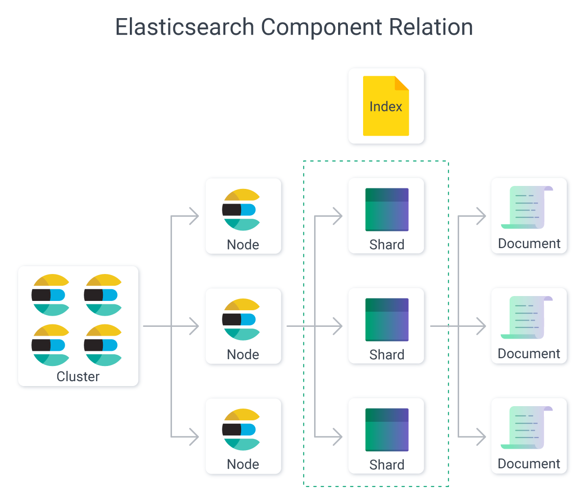

# Leak Searcher Bot

Example run:

[](https://www.youtube.com/watch?v=pyetHSV5Wn8&t=397s)




Leak Searcher is a Telegram bot designed to interact with Elasticsearch to search, retrieve, and manage leaked data efficiently. The bot provides features for querying Elasticsearch indices, retrieving matched results, and sending the results to authorized users in a readable format.

## Features

- **Authorization**: Only authorized users can access the bot's functionality.


- **Search Across Multiple Indices**: The bot supports searching across all Elasticsearch indices (`*` wildcard).


- **Scroll API Integration**: Handles large datasets by utilizing Elasticsearch's Scroll API.


- **Result Export**: Saves matched results to a `.txt` file and sends it to users via Telegram.


- **Command Help**: Lists all available commands for ease of use.


## Commands

- `/start`: Initialize the bot and display a welcome message.
- `/authorize`: Authorize a user to use the bot.
- `/listleaks`: List all available Elasticsearch indices (requires authorization).
- `/search`: Perform a keyword search across indices and retrieve results (requires authorization).
- `/help`: Display all available commands and their descriptions.

## Requirements

- Python 3.8 or higher
- Elasticsearch
- Telegram Botfather API Token

## Installation

1. Clone the repository:
   ```bash
   git clone https://github.com/yourusername/leak_manager_bot.git
   cd leak_manager_bot
   ```

2. Create a virtual environment and activate it:
   ```bash
   python -m venv venv
   source venv/bin/activate
   ```

   ```bash
   python -m venv venv
   venv\Scripts\activate
   ```

3. Install the required dependencies:
   ```bash
   pip install -r requirements.txt
   ```

4. Configure the bot:

   - Set your Telegram Bot Token as an environment variable:
     ```bash
     export TELEGRAM_BOT_TOKEN="your-telegram-bot-token"
     ```
   - Optionally, set Elasticsearch credentials:
     ```bash
     export ELASTIC_HOST="http://localhost:9200"
     export ELASTIC_USERNAME="your-username"
     export ELASTIC_PASSWORD="your-password"
     ```

5. Run the bot:

   ```bash
   python bot.py
   ```

## Elasticsearch Configuration

- Ensure that Elasticsearch is running and accessible. The bot connects to the Elasticsearch server configured in the environment variables.

- To run elastic search download from here: 

```
https://www.elastic.co/downloads/elasticsearch
```

- Configure `elasticsearch.yaml` file and `log4j2.properties` or replace mine.

### Index Management

To manage indices and add data to Elasticsearch, you can use the provided `elastic_manager.py` script.

## Project Structure

```
    .
├── bot.py               # Main script for Telegram bot
├── elastic_manager.py   # Script for managing Elasticsearch operations
├── requirements.txt     # Python dependencies
├── README.md            # Project documentation

```

## Usage

### Searching for Data
1. Use `/authorize` to authorize yourself if not already authorized.
2. Use `/search` and provide the desired keyword to search.
3. The bot will return results as messages or as a `.txt` file if the result set is large.
4. Use `/start` to invoke the Telegram bot.

### Listing Indices
1. Use `/listleaks` to list all available Elasticsearch indices.

## Known Issues

- The bot may not respond correctly if Elasticsearch is not running or properly configured.
- Ensure Elasticsearch indices are correctly populated with data before searching.

## Contributing

Contributions are welcome! Please fork the repository and submit a pull request for any improvements.

## License

This project is licensed under the MIT License.

---

Happy searching ! xD